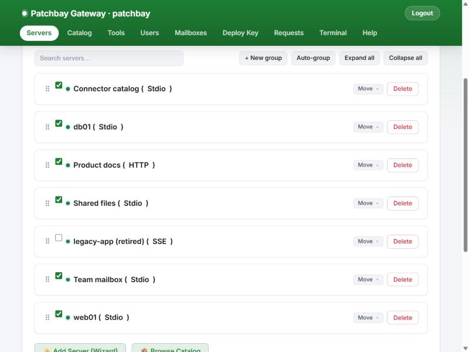
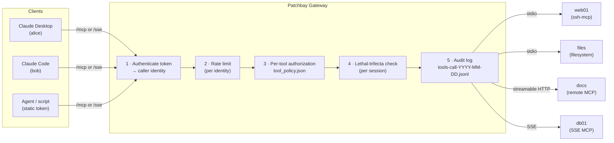
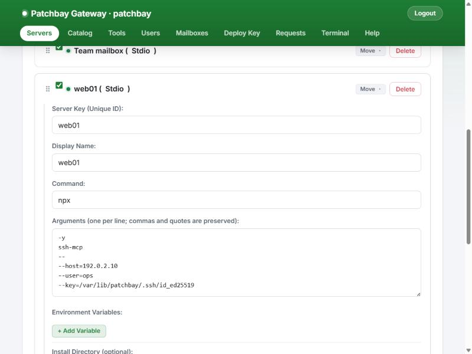
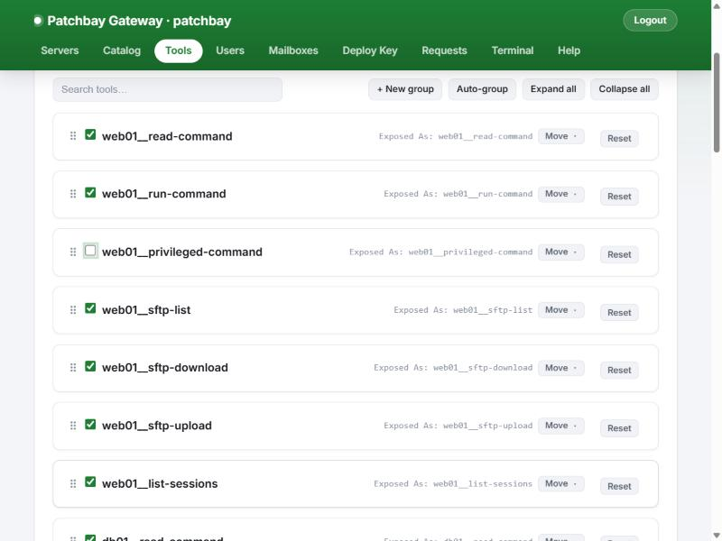
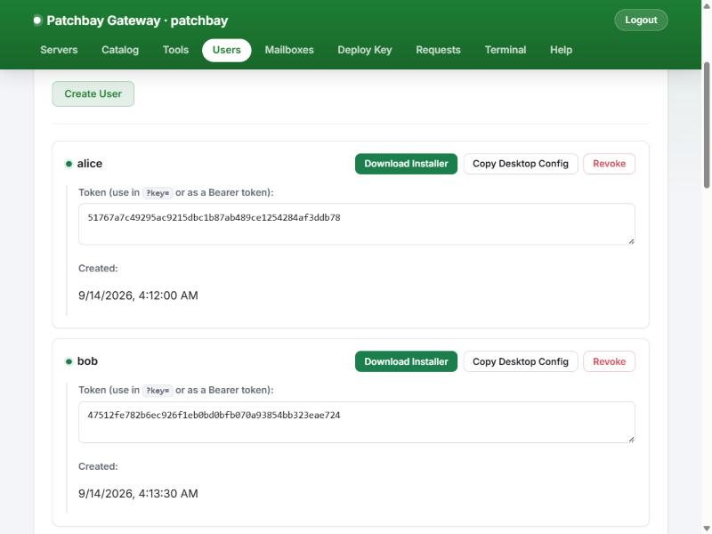
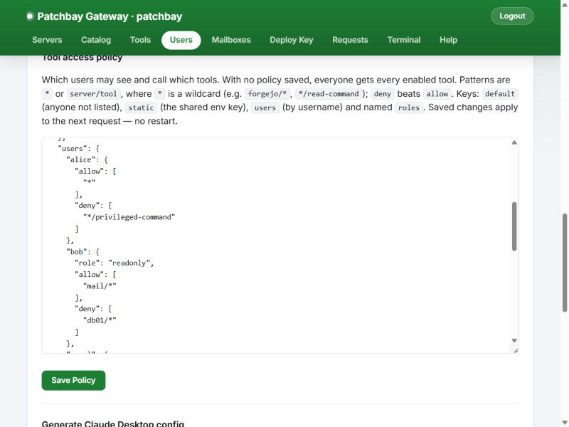
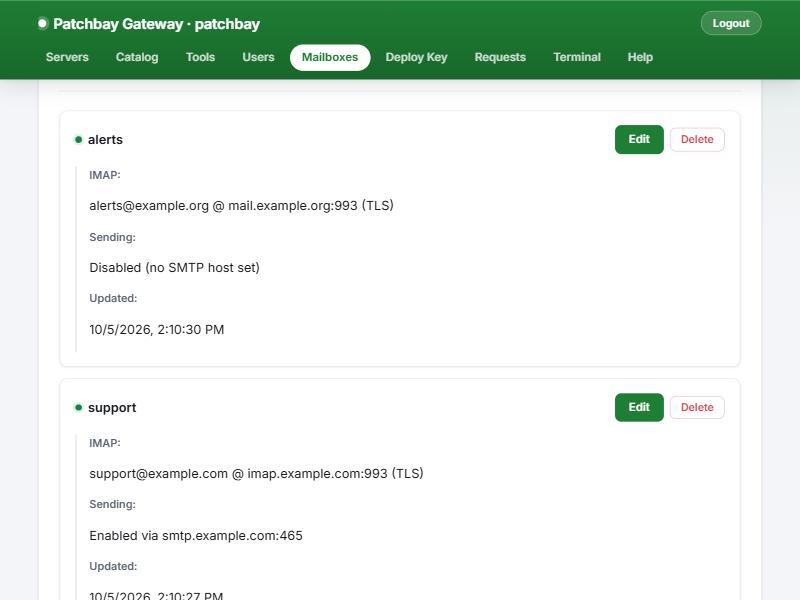

# Patchbay Gateway

**One MCP endpoint for all your MCP servers, with identity, per-tool authorization,
lethal-trifecta blocking and an audit trail in front of every tool call.**

Patchbay Gateway is a self-hosted [Model Context Protocol](https://modelcontextprotocol.io)
gateway. It connects to any number of MCP servers (stdio, SSE or streamable HTTP),
publishes all of their tools behind a single `/mcp` endpoint, and decides *per caller*
and *per session* which of those tools may run. It is a fork of
[ptbsare/mcp-proxy-server](https://github.com/ptbsare/mcp-proxy-server); see
[Credits](#credits-and-license) and the [CHANGELOG](CHANGELOG.md) for what the fork adds.



- [What a gateway is (and how it differs from a proxy)](#what-an-mcp-gateway-is)
- [Feature tour](#feature-tour)
- [Quick start](#quick-start)
- [Documentation](#documentation)
- [Security model and limits](#security-model-and-limits)
- [Credits and license](#credits-and-license)

---

## What an MCP gateway is

An MCP client (Claude Desktop, Claude Code, an agent framework) normally starts or
connects to each MCP server on its own: one config entry per server, one set of
credentials per client machine, no shared view of who called what.

A **proxy** fixes the plumbing. It forwards traffic from a client to *a* server,
perhaps translating stdio into HTTP so the server can live somewhere else. It does not
decide anything. Every caller gets every tool, and the proxy has no idea who is calling.

A **gateway** sits in the same place but owns the policy. Patchbay:

| | Plain proxy | Patchbay Gateway |
|---|---|---|
| Backends | One server per endpoint | Many servers aggregated behind one endpoint; tools are namespaced `server__tool` |
| Transports | Usually one | Backends over stdio, SSE or streamable HTTP; clients over streamable HTTP (`/mcp`) or SSE (`/sse`) |
| Who is calling | Unknown | Each caller presents a **personal token**; every request resolves to a named identity |
| What they may call | Everything | **Per-tool authorization** from `tool_policy.json`: allow/deny globs per user, role or default, enforced on `tools/list` *and* `tools/call` |
| Prompt-injection blast radius | Unlimited | **Lethal-trifecta blocking**: a session that has touched private data and untrusted content cannot also use an outbound channel |
| Record of what happened | None | Append-only JSON Lines **audit log** of every `tools/call`, including denials and blocks |
| Runaway agents | Reach every backend | **Per-identity rate limits** on tool calls and HTTP requests |
| Changing config | Restart | Users and policy apply on the next request; backend edits apply with an in-process **reload** that only reconnects the servers you changed |
| Operating it | Edit JSON | **Admin web UI** for servers, tools, users, policy, mailboxes, client installers and a terminal |



A `tools/call` goes through those steps in that order. A call that is throttled,
denied or blocked never reaches a backend, and denials and blocks are written to the
audit log like any other call. A throttled call gets a coalesced `rate-limit` line
instead of one line per rejection.

### What each layer does

**Per-user identity.** Admins create users in the **Users** tab (or `config/users.json`).
Each user gets a random 48-character token. Clients present it as
`Authorization: Bearer <token>`, `X-Api-Key: <token>` or `?key=<token>`. The gateway
resolves every request to an identity (`alice`, `bob`, `static` for the shared
`ALLOWED_TOKENS`/`ALLOWED_KEYS` credential, or `anonymous` when authentication is off).
Creating or revoking a user takes effect immediately, with no restart.

**Per-tool authorization.** `config/tool_policy.json` holds allow and deny lists of
`"<backend>/<tool>"` globs for each user, for named roles, for the static credential and
for everyone else. Deny beats allow. A tool a caller may not use is removed from their
`tools/list` and refused on `tools/call` with JSON-RPC error `-32003`. No file means
everyone keeps every enabled tool; an invalid file **fails closed** and denies
everything until it is fixed.

**Lethal-trifecta blocking.** Every tool is classified on three axes: reads
`privateData`, ingests `untrustedContent`, or has an `externalComm` channel. The
gateway tracks which axes each MCP session has touched and refuses (error `-32010`) the
call that would give one session all three, before it is forwarded. That is the
combination a single prompt-injected email or web page needs to read something
sensitive and send it out. Built-in defaults recognise ssh-mcp, an IMAP mail
connector and Context7; anything unrecognised is treated as untrusted + external.
Everything is overridable, and there are `monitor` and `off` modes. See
[TRIFECTA.md](TRIFECTA.md).

**Audit log.** One JSON object per `tools/call`, appended to a file per UTC day:
who, which session, which tool and backend, allow/deny and the rule that decided,
duration, error code and any trifecta detail. Tool arguments are **not** recorded unless
you opt in. Tokens never are. Files rotate at a size cap and are pruned after a
retention period.

**Rate limits.** Two token buckets per identity: one for `tools/call` (default burst 60,
120/min) and a looser one for every authenticated HTTP request (burst 120, 300/min).
Callers without an identity are bucketed per IP or per session. A throttled tool call
gets JSON-RPC error `-32011` with the retry delay. A throttled HTTP request gets
`429` and a `Retry-After` header.

**Live reload.** Users and the tool policy are re-read on change and apply to the next
request, including on sessions that are already open. Server and tool edits apply with
the admin UI's reload button. It reconnects only the backends whose config changed and
leaves the others running.

**Admin web UI** (optional, `ENABLE_ADMIN_UI=true`). Manage backend servers (add, edit,
enable/disable, install, reorder, group), browse a connector catalog, enable/rename
individual tools, create and revoke users, download a per-user Windows client
installer, edit the tool policy, manage IMAP mailboxes for a mail connector, push the
gateway's SSH key to a new host, review end-user connector requests, and open a web
terminal on the gateway host.

**Text-block merging** (optional, off by default). Some clients only read the
*first* content block of a tool result; the OpenAI Responses API's remote MCP tool is
one. `MCP_MERGE_TEXT_CONTENT=true` (or a per-user `mergeTextContent`) joins adjacent
text blocks so those clients see the whole answer.

---

## Feature tour

> Screenshots are from a demo instance with made-up servers and users.

### Servers

Every backend MCP server in one list: its transport, whether it is active, and
controls to edit, install or remove it. Servers can be searched, grouped into
collapsible sections and drag-ordered. The order also drives the order of `tools/list`,
which keeps the client's prompt cache stable. **Reload** applies edits without
restarting the gateway.


Each server opens in an editor with fields for its transport: command, one argument per
line and environment for stdio; URL and API key or bearer token for SSE and HTTP. A
guided **Add Server** wizard and a **Catalog** of well-known MCP servers make adding one
a few clicks.



### Tools

Every tool discovered from every active backend. Disable a tool gateway-wide, or override
the name and description the client sees. Overrides are cosmetic: authorization and
trifecta rules always match the original backend and tool names.



### Users and client installers

Create a user and their token is live immediately; revoke it the same way. For each
user the tab generates a ready-to-paste Claude Desktop config or a **Windows installer
bundle**: a zip with a portable Node.js, a pre-installed `mcp-remote` and the user's
token, which merges one entry into `claude_desktop_config.json`. See
[docs/client-setup.md](docs/client-setup.md).



### Tool policy

The same tab edits `config/tool_policy.json`, including the `trifecta` section. The
gateway validates the policy before saving it, so a typo is rejected instead of locking
everyone out. The next request uses the new policy.



### Lethal-trifecta block and audit trail

In the demo, alice reads a host (`web01__read-command`: private data), then reads an
email (`mail__read_email`: untrusted content), then asks to send mail
(`mail__send_email`: an outbound channel). The gateway refuses the third call before
it reaches the mail backend:

```text
MCP error -32010: Blocked by the gateway's lethal-trifecta policy: "mail__send_email"
would communicate externally, and this session has already used tools that read
private data (via web01__read-command) and read untrusted outside content (via
mail__read_email). [...] Nothing was sent to the backend. Other calls in this session
still work; to make this call, do it in a new session [...]
```

Every step is in the audit log. These are lines from the demo, with some fields
trimmed:

```json
{"ts":"2026-10-05T18:03:33.696Z","event":"tools/call","user":"alice","identityKind":"user","tool":"web01__read-command","backend":"web01","ok":true,"decision":"allow","authzRule":"users.alice","durationMs":5}
{"ts":"2026-10-05T18:03:33.707Z","event":"tools/call","user":"alice","identityKind":"user","tool":"mail__read_email","backend":"mail","ok":true,"decision":"allow","authzRule":"users.alice","durationMs":4}
{"ts":"2026-10-05T18:03:33.715Z","event":"tools/call","user":"alice","identityKind":"user","tool":"mail__send_email","backend":"mail","ok":false,"decision":"allow","authzRule":"users.alice","durationMs":1,"errorCode":-32010,"trifecta":{"mode":"enforce","sessionAxes":["privateData","untrustedContent"],"toolAxes":["externalComm"],"completing":["externalComm"],"sources":{"privateData":"web01__read-command","untrustedContent":"mail__read_email"},"blocked":true}}
{"ts":"2026-10-05T18:03:33.723Z","event":"tools/call","user":"alice","identityKind":"user","tool":"web01__privileged-command","backend":"web01","ok":false,"decision":"deny","authzRule":"users.alice","authzReason":"matched deny","durationMs":0,"errorCode":-32003}
```

The last line is the tool policy at work: alice may use everything except
`*/privileged-command`.

### Mailboxes

If you run an IMAP/SMTP MCP connector behind the gateway, the **Mailboxes** tab manages
its accounts. Passwords are encrypted at rest (AES-256-GCM) and never sent back to the
browser. Saving regenerates the connector's own accounts file and reconnects only that
backend.



### Also in the admin UI

- **Catalog:** browse curated and registry MCP servers and add one in a click. Users
  can *request* a connector from their client through the bundled `catalog-server`,
  and admins approve or reject requests in the **Requests** tab.
- **Deploy Key:** one-shot, password-authenticated SSH that appends the gateway's
  public key to a new host's `authorized_keys`. The password is used once and not
  stored.
- **Terminal:** a shell on the gateway host in the browser. Secrets (`ADMIN_*`,
  `ALLOWED_*`, `*_SECRET`, `*_PASSWORD`, `*_TOKEN`, `*_KEY`) are stripped from its
  environment.
- **Help:** a built-in how-to and glossary.
- **Per-gateway branding:** `GATEWAY_CLIENT_NAME` and `GATEWAY_UI_COLOR` label the
  tab, header and favicon, so you can tell several gateways apart.

---

## Quick start

On a Linux host with Node.js 20+ (no containers needed):

```bash
git clone https://github.com/<you>/patchbay-gateway.git /opt/patchbay-gateway
cd /opt/patchbay-gateway
npm install && npm run build
cp config/mcp_server.json.example config/mcp_server.json   # then edit it
ENABLE_ADMIN_UI=true ADMIN_PASSWORD='change-me' MCP_AUDIT_DIR=./audit node build/sse.js
```

Open `http://<host>:3663/admin`, create a user in the **Users** tab, and point a client
at `http://<host>:3663/mcp?key=<token>`.

For a real deployment (systemd unit, env file, firewall, upgrades) follow
**[docs/install.md](docs/install.md)**.

## Documentation

| Document | Contents |
|---|---|
| [docs/install.md](docs/install.md) | Native install on Linux with systemd, env file, firewall, upgrades |
| [docs/configuration.md](docs/configuration.md) | Every environment variable, `mcp_server.json`, `users.json`, `tool_policy.json`, rate limits, audit log |
| [docs/client-setup.md](docs/client-setup.md) | Claude Desktop, Claude Code and other clients via `mcp-remote`; the Windows installer bundle |
| [TRIFECTA.md](TRIFECTA.md) | The lethal-trifecta model, default classification and the `trifecta` policy section in depth |
| [CHANGELOG.md](CHANGELOG.md) | What this fork adds over upstream |
| [FORK_NOTES.md](FORK_NOTES.md) | Implementation notes on each change, for contributors |
| [deploy/](deploy/) | Minimal example systemd unit and env file |
| [docs/guard.md](docs/guard.md) | The leak guard that runs in `npm test` and the pre-commit hook |

### Contributing

`npm test` builds the project, runs the offline tests under `test/` and runs the leak
guard, which needs [gitleaks](https://github.com/gitleaks/gitleaks) and refuses secrets
and private IP addresses. `npm run hooks:install` runs the guard on every commit. Use
RFC 5737 addresses (`192.0.2.x`) and generic host names (`web01`) in examples and
tests.

---

## Security model and limits

Read this before you expose a gateway to anyone.

- **The admin UI is root on the gateway host.** It runs install commands and opens a
  terminal as the service user. Use a strong `ADMIN_PASSWORD`, keep the UI on a private
  network, and leave `ENABLE_ADMIN_UI` unset where you don't need it. Logins are
  throttled per IP, the session cookie is `SameSite=Strict` and `HttpOnly`, and session
  IDs are regenerated on login.
- **The gateway speaks plain HTTP.** It has no TLS of its own and no bind-address
  setting: it listens on every interface on `PORT`. Restrict it with a host firewall to
  a private network or VPN, or put a TLS-terminating reverse proxy in front.
  [docs/install.md](docs/install.md#5-firewall) has the details.
- **Tokens are bearer secrets.** `config/users.json` holds them in plain text, mode
  `0600` recommended. Anyone holding a token is that user until you revoke it.
- **Tool policy covers tools only.** Backend *resources* and *prompts* are aggregated
  but not yet scoped by `tool_policy.json`.
- **The trifecta check is per session and per tool.** A client can reset its state
  by opening a new session, so the check stops content that hijacks an agent
  mid-session, not a malicious client. It also can't see tools the client holds
  outside the gateway. See [TRIFECTA.md](TRIFECTA.md#known-limits).

## Credits and license

Patchbay Gateway is MIT-licensed, like the projects it is forked from. See
[LICENSE](LICENSE) and [NOTICE](NOTICE).

- **[ptbsare/mcp-proxy-server](https://github.com/ptbsare/mcp-proxy-server)** by
  ptbsare is the upstream project. It provides the aggregation core, the
  stdio/SSE/HTTP transports, the original admin UI, tool overrides, the install runner
  and the web terminal. It was itself refactored from
  [adamwattis/mcp-proxy-server](https://github.com/adamwattis/mcp-proxy-server) by Adam
  Wattis.
- **willscottuk**'s fork contributed the security audit (`d12590dc`) whose findings
  this fork fixes, the idea for merging adjacent text blocks (`190093a1`) and the
  config-diff approach for reloads (`75d535b`).
- **matuszeg**'s fork first fixed shared-server session routing by giving each client
  session its own server instance (`40d702cd`).
- The lethal-trifecta model comes from Simon Willison's writing and the Open Edison
  project. `src/trifecta.ts` is an independent implementation; no Open Edison
  (GPL-3.0) code is used.
